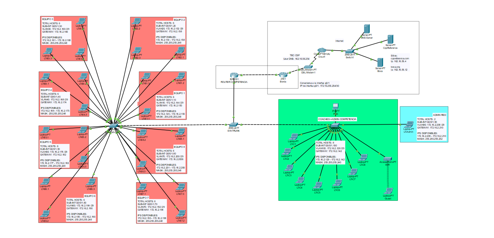

# git-lab

## Description

Git practice laboratory

Fernando Adrián Fuentes Martínez.

## Contents

### LICENSE
### README.md
### hello_world.py
### IMAGES

## References

[Github documentation](https://docs.github.com/en)

[Github glossary](https://docs.github.com/en/get-started/learning-about-github/github-glossary)

[Git documentation](https://git-scm.com/doc)

